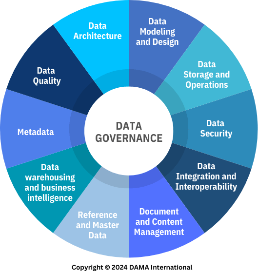
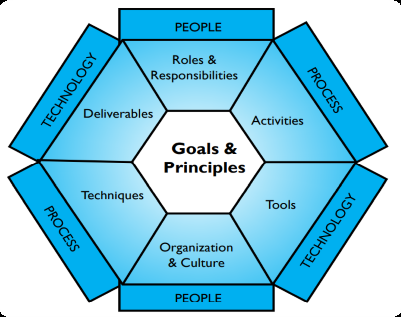

# DataManagement overview <!-- omit in toc -->

## Contents <!-- omit in toc -->

- [1. Source](#1-source)
- [2. What is Data Management](#2-what-is-data-management)
- [3. Data Management Essential Concepts](#3-data-management-essential-concepts)
  - [3.1. Data vs. Information](#31-data-vs-information)
- [4. Data Management Principles](#4-data-management-principles)
  - [4.1. Summary Table](#41-summary-table)
- [5. The DAMA-DMBOK Framework](#5-the-dama-dmbok-framework)
- [6. Data Ethics](#6-data-ethics)
  - [6.1. Essential Concepts](#61-essential-concepts)
    - [6.1.1. Ethical Principles for Data](#611-ethical-principles-for-data)
    - [6.1.2. Data Privacy Law.](#612-data-privacy-law)
    - [6.1.3. Data Ethics for Online Data](#613-data-ethics-for-online-data)
    - [6.1.4. Risks of unethical data handling](#614-risks-of-unethical-data-handling)
    - [6.1.5. Establishing Ethical Data Culture](#615-establishing-ethical-data-culture)
- [7. Data Modeling](#7-data-modeling)
  - [7.1. Importance of Data Modeling and Design](#71-importance-of-data-modeling-and-design)
  - [7.2. What is a Data Model](#72-what-is-a-data-model)
  - [7.3. Four Types of data that can be modeled](#73-four-types-of-data-that-can-be-modeled)
  - [7.4. Data Model components](#74-data-model-components)
  - [7.5. Data Model Levels](#75-data-model-levels)
  - [7.6. Data Modeling Activities](#76-data-modeling-activities)
  - [7.7. Data Modeling Tools](#77-data-modeling-tools)

# 1. Source

- _DAMA International. Data Management Body of Knowledge (DMBoK) (2nd ed. revised). Technics Publications._

# 2. What is Data Management

- Data Management is the development, execution, and supervision of plans, policies, programs, and practices that deliver, control, protect, and enhance the value of data and information assets throughout their lifecycles.

# 3. Data Management Essential Concepts

- Data.
  - **Data** consists of **raw facts and figures** that can be processed to generate meaningful information.
- Information.
  - **Information** is **processed data** that has context, meaning, and value, enabling better decision-making.
- Data as an Organizational Asset.
  - Organizations recognize **data as a valuable business asset** that can drive growth and competitive advantage.
- **Proper data management maximizes**
  - Business value.
  - Decision quality.
  - Operational efficiency.

## 3.1. Data vs. Information

| Data       | Information                    |
| ---------- | ------------------------------ |
| Raw facts  | Processed and meaningful facts |
| No context | Includes context and analysis  |
| Stored     | Used for decision-making       |

# 4. Data Management Principles

1. Data as an Asset.
   - Organizations should treat **data as a valuable business asset**.
2. Economic Value of Data.
   - Proper data management creates **financial and operational benefits**.
3. Quality Management.
   - High-quality data must be:
     - Accurate.
     - Consistent.
     - Reliable.
     - Timely.
4. Role of Metadata.
   - Metadata provides context that makes data easier to understand and use.
5. Planning is Essential.
   - Successful data management requires strategic planning.
6. Cross-Functional Collaboration.
   - Data management requires cooperation across departments.
7. Enterprise Perspective.
   - Data management should be managed **across the entire organization**, not in isolated departments.
8. Lifecycle Management.
   - Manage data throughout its entire lifecycle:
9. Risk Management.
   - Organizations must identify and reduce data-related risks.
10. IT Alignment.
    - IT initiatives must support business objectives.
11. Leadership Commitment.
    - Strong leadership is essential for successful data management.

## 4.1. Summary Table

| Principle                      | Main Idea                                           |
| ------------------------------ | --------------------------------------------------- |
| Data as an Asset               | Treat data as a valuable business asset.            |
| Economic Value                 | Data generates financial and operational value.     |
| Quality Management             | Ensure accurate, reliable, and timely data.         |
| Metadata                       | Data about data that provides context.              |
| Planning                       | Define goals and implementation roadmap.            |
| Cross-Functional Collaboration | Departments work together on shared data practices. |
| Enterprise Perspective         | Manage data across the entire organization.         |
| Data Lifecycle Management      | Control data from creation to deletion.             |
| Risk Management                | Protect data security, privacy, and compliance.     |
| IT Alignment                   | Align technology with business goals.               |
| Leadership Commitment          | Executive support is critical for success.          |

# 5. The DAMA-DMBOK Framework

- https://dama.org/
- **Data Management Framework (The DAMA Wheel)**
  
- **DAMA Environmental Factor Hexagon**
  

# 6. Data Ethics

- What is Data Ethics?
  - Data ethics is a set of moral principles that guide how we collect, use, and manage data.
  - It helps ensure that data practices respect people's rights and promote fairness.
    [Ethical Principles Summary](/material/data-ethics/ethical-principles-summary.md)

## 6.1. Essential Concepts

- Ethical Principles for Data.
- Principles Behind Data Privacy Law.
- Online Data in Ethical Context.
- Risks of Unethical Data Handling.
- Establishing Ethical Data Culture.

### 6.1.1. Ethical Principles for Data

1. **Respect for Individuals**
   - Organizations must respect individuals' rights when collecting and using personal data.
   - **Privacy and Autonomy**
     - Obtain consent before collecting personal data.
     - Allow individuals to control how their data is used.
     - Respect users' choices regarding data collection and processing.
   - **Dignity**
     - Treat individuals as people, not merely as data.
     - Ensure data practices do not exploit or harm individuals.
     - Protect fundamental rights throughout the data lifecycle.
2. **Transparency**
   - Organizations should clearly communicate their data practices.
   - **Clear Communication**
     - **Inform individuals about**
       - What data is collected.
       - Why the data is collected.
       - How the data will be used.
       - Who will have access to the data.
       - Whether data will be shared with third parties.
       - How long the data will be stored.
       - How the data will be disposed of.
3. **Accountability**
   - Organizations are responsible for ensuring ethical and legal data practices.
   - **Responsibilities**
     - Comply with applicable laws and regulations.
     - Take responsibility for data breaches or unethical practices.
     - Address ethical concerns promptly.
     - Implement processes for reporting misconduct or data-related issues.

### 6.1.2. Data Privacy Law.

- Organizations must comply with applicable **data privacy laws**, depending on their country, industry, and the type of data they process.
- **Examples**
  - [LGPD](https://www.gov.br/mds/pt-br/acesso-a-informacao/governanca/integridade/campanhas/lgpd)
  - GDPR (European Union)
  - CCPA (California Consumer Privacy Act)
  - New York SHIELD Act
  - Colorado Privacy Act
  - E-Government Act

1. **Informed Consent**
   - **Individuals must receive clear information about**
     - What data is collected.
     - Why it is collected.
     - How it will be used.
     - Potential risks and benefits.
2. **Purpose Limitation**
   - Data should only be collected for a **specific, legitimate, and clearly defined purpose**.
   - **Organizations should**
     - Clearly state the purpose of data collection.
     - Avoid using data for unrelated purposes without obtaining new consent.
     - Define how long data will be retained.
     - Delete data when it is no longer needed.
3. **Data Minimization**
   - Organizations should collect **only the data necessary** for the intended purpose.
     - **Benefits**
       - Reduces privacy risks.
       - Improves security.
       - Simplifies compliance.

### 6.1.3. Data Ethics for Online Data

- Individuals retain ownership and control of their personal data, even after sharing it with an organization.

1. **Digital data rights**
   - Individuals retain ownership and control of their personal data, even after sharing it with an organization.
   - **Access Rights**
     - **Individuals have the right to**
       - Access the personal data an organization holds about them.
     - **Understand**
       - What data is collected.
       - How it is used.
       - Why it is collected.
   - **Right to Deletion**
     - Individuals have the right to request the deletion of their personal data under applicable laws.
       - **Organizations should**
         - Delete personal data when requested (when legally applicable).
         - Avoid retaining data longer than necessary.
         - Follow data retention policies.
2. **Data Ownership**
   - Individuals maintain ownership of their personal data.
   - **Examples**
     - Personal information shared with websites.
     - Articles or content published online.
   - Sharing data does **not** transfer ownership.
3. **Freedom of speech**
   - Individuals have the right to express their opinions online.
   - However, freedom of speech does **not** justify:
     - Harassment.
     - Bullying.
     - Hate speech.
     - Threats.
     - Terrorism-related content.

### 6.1.4. Risks of unethical data handling

- Unethical data handling can harm individuals, organizations, and society, leading to legal, financial, and reputational consequences.

1. **Data Breaches**
   - A **data breach** occurs when unauthorized individuals gain access to sensitive or confidential information.
   - **Prevention**
     - Strong security measures
     - Access controls
     - Employee training
     - Data protection policies
   - **Impact**
     - Exposure of personal data
     - Identity theft
     - Loss of customer confidence
2. **Discrimination and Bias**
   - Biased data or algorithms can result in unfair treatment of individuals.
   - **Examples**
     - Biased hiring systems
     - Unfair loan approvals
     - Discriminatory recommendations
   - **Impact**
     - Inequality
     - Unfair decisions
     - Reduced diversity
     - Ethical and legal issues
3. **Financial and Legal Consequences**
   - **Poor data practices can result in**
     - Regulatory fines
     - Lawsuits
     - Compliance violations
     - Financial losses
4. **Loss of Trust**
   - Customers and stakeholders may lose confidence in organizations that mishandle personal data.
   - **Consequences**
     - Reputation damage
     - Customer loss
     - Reduced business opportunities
     - Lower customer loyalty
5. **Manipulative Marketing Practices**
   - Using personal data to exploit customer vulnerabilities or influence purchasing decisions unethically.
   - **Examples**
     - Fear-based advertising
     - Misleading targeted ads
     - Exploiting personal insecurities
   - **Ethical Marketing**
     - **Organizations should**
       - Be transparent about data usage.
       - Respect customer privacy.
       - Use personal data responsibly.

### 6.1.5. Establishing Ethical Data Culture

1. **Leadership Commitment**
   - Leaders play a critical role in promoting ethical data practices.
   - **Responsibilities**
     - Lead by example.
     - Communicate the importance of data ethics.
     - Set clear expectations for employees.
     - Promote ethical behavior throughout the organization.
   - **Resource Allocation**
     - **Leadership should provide**
       - Budget
       - Personnel
       - Technology
       - Tools and policies to support ethical data initiatives
   - Without leadership support, ethical data programs are unlikely to succeed.
2. **Training and Awareness**
   - Organizations should educate employees on ethical data practices.
     - **Training Topics**
     - Data privacy laws
     - Ethical data handling
     - Data protection policies
     - Consequences of unethical behavior
     - Organizational responsibilities
   - **Awareness Programs**
     - **Companies often**
       - Require mandatory annual training.
       - Assess employee understanding through quizzes or certifications.
       - Reinforce ethical behavior through continuous education.

# 7. Data Modeling

- Data modeling is the process of discovering, analyzing, and scoping data requirements, and then representing and communicating these data requirements in a precise form called the data model.

## 7.1. Importance of Data Modeling and Design

- Clarifying Data Relationships.
- Aligning with Business Needs.
- Improving Data Quality.
- Facilitating Communication.
- Supporting Scalability and Adaptability.
- Guiding System Development.

## 7.2. What is a Data Model

- A data model is an abstract representation that organizes elements of data and standardizes how they relate to one another and to real-world entities.
- It serves as a framework for structuring data within a database or information system, helping to define the relationships, attributes, and constraints of the data involved.

## 7.3. Four Types of data that can be modeled

- Category information.
- Resource information.
- Business event information.
- Detail transaction information.

## 7.4. Data Model components

- Entities.
- Relationships.
- Attributes.
- Primary Keys.
- Foreign Keys.
- Domain.

## 7.5. Data Model Levels

- Conceptual.
- Logical.
- Physical.

## 7.6. Data Modeling Activities

- Plan for Data Modeling.
- Build the Data Models.
- Review the Data Models.
- Maintain the Data Models.

## 7.7. Data Modeling Tools

- Data Modeling Tools.
- Lineage Tools.
- Data Profiling Tools.
- Metadata Repositories.
- Data Model Patterns.
- Industry Data Models.
